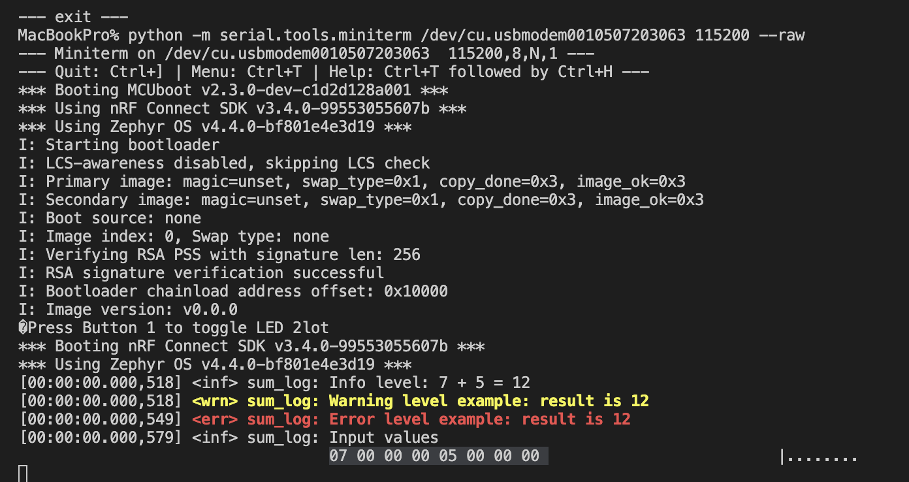
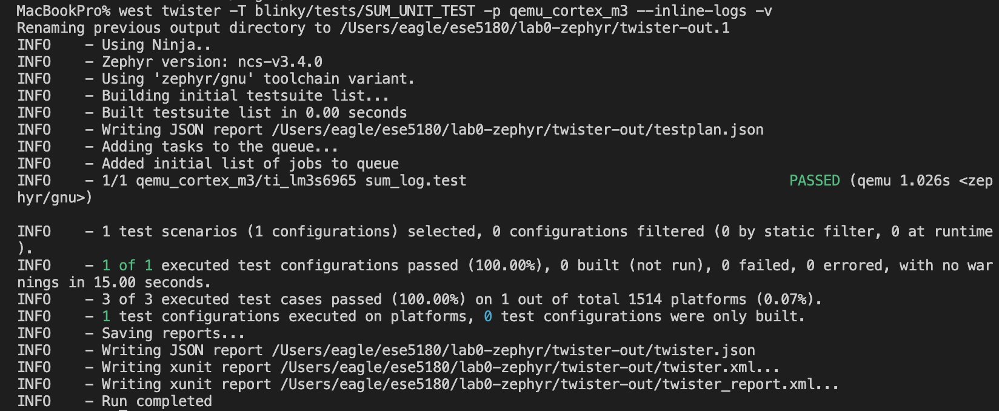
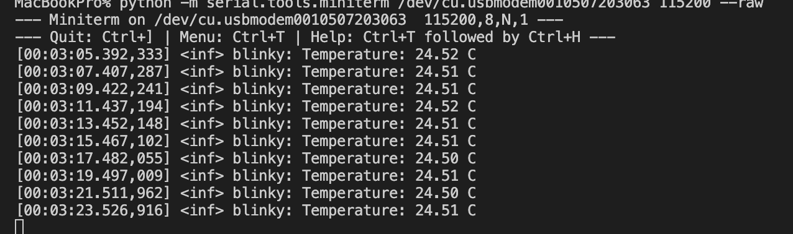
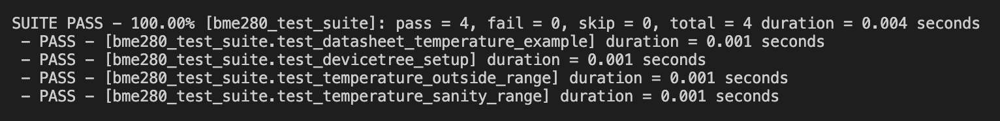

# ESE5180: Lab 0 Zephyr

| Team Member Name | Email Address       |
|------------------|---------------------|
| Zhiyuan Chen     | chennn@engineering.upenn.edu |

**GitHub Repository URL:** https://github.com/chennn0224/Lab0

## 1. Sample Header

## 2. Sample Second Header

## 3. Building with West

## 6. Printing and Logging

### Printk output

### Logger output

## 7. Ztest Unit Testing

The sum tests cover positive values, negative values, and zero. All three test cases pass in
QEMU, and the test application also builds successfully for the nRF7002 DK.

## 8. BME280 Temperature Sensor

### Temperature logging output

### BME280 Ztest output

The four tests check the data sheet example, devicetree setup, valid temperature range, and
out-of-range rejection.

