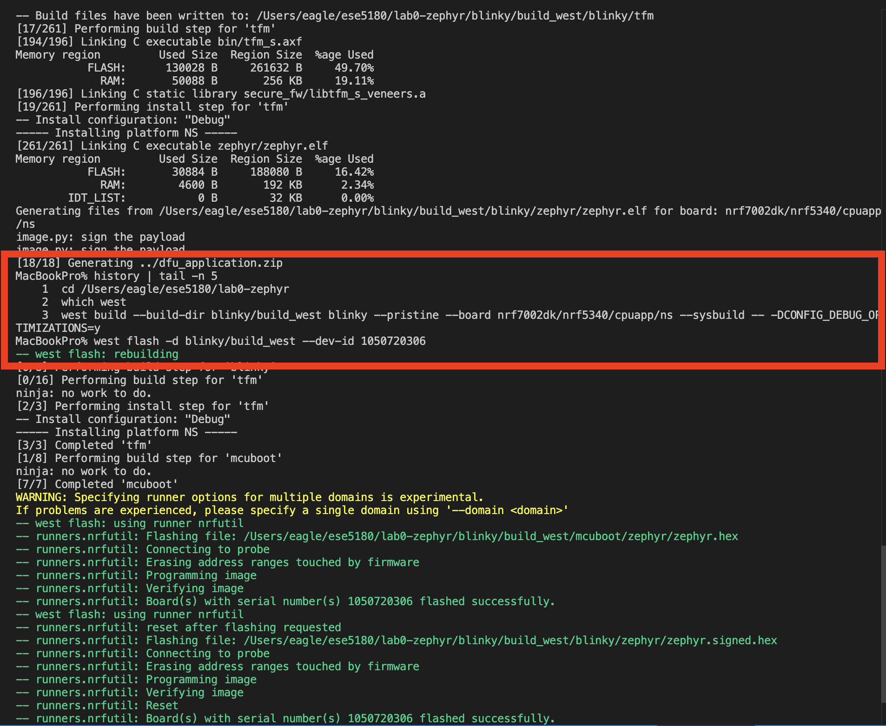

# ESE5180: Lab 0 Zephyr

| Team Member Name | Email Address       |
|------------------|---------------------|
| Zhiyuan Chen     | chennn@engineering.upenn.edu |

**GitHub Repository URL:** https://github.com/chennn0224/Lab0

## 1. Sample Header

## 2. Sample Second Header

## 3. Building with West

## 7. Ztest Unit Testing

The sum tests cover positive values, negative values, and zero. All three test cases pass in
QEMU, and the test application also builds successfully for the nRF7002 DK.

### Where is `main()` in Ztest?

The test application does not define its own `main()`. Enabling `CONFIG_ZTEST` includes the Ztest
runner, which supplies the entry point, discovers the tests registered by `ZTEST` and
`ZTEST_SUITE`, and runs them automatically.

### `west build` and `west twister`

| | `west build` | `west twister` |
|---|---|---|
| Main purpose | Build one application for one selected board | Discover, build, run, and report test suites |
| Test discovery | Does not read test metadata to select multiple tests | Reads `testcase.yaml` and applies its platform and tag filters |
| Execution | Use a run target such as `west build -t run` for QEMU | Runs supported simulations automatically unless `--build-only` is used |
| Best use | Developing or debugging one test application | Regression testing across tests and platforms |
